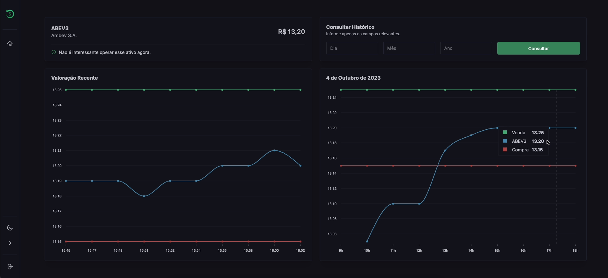

# Monitor de Cotações

Este projeto é uma aplicação web para monitoramento de ações e ativos financeiros. Proporciona uma visão clara das cotações, permitindo aos usuários definirem limites de prejuízo e lucro para suas operações. Além disso, envia avisos por e-mail para os investidores recomendando compra ou venda de ações quando a cotação delas cruza esses limites.



## Features

- **Monitoramento ativo:** A cotação de cada ação é monitorada periodicamente de acordo com o intervalo de tempo definido pelo investidor.
- **Avisos automáticos:** O investidor recebe notificações por e-mail com recomendações de compra e venda baseadas nos parâmetros de túnel definidos.
- **Multiusuários:** Suporte a contas para múltiplos investidores, com autenticação JWT.
- **Temas:** Suporte a temas claro e escuro.

## Pré-requisitos

Para rodar a aplicação localmente, você precisará das seguintes ferramentas instaladas:

- [Node.js](https://nodejs.org)
- [Python](https://www.python.org)
- [Git](https://git-scm.com)

## Clonando o Repositório

Comece clonando o repositório:

```bash
git clone https://github.com/vonkakarius/quotation.git
cd quotation
```

## Configurações de Variáveis de Ambiente

Este projeto requer a configuração de variáveis de ambiente para funcionar corretamente. Dentro do diretório `backend`, crie um arquivo .env e configure as seguintes variáveis, das quais apenas as 3 primeiras são necessárias:

```bash
SECRET_KEY=sua_chave_secreta_jwt
DEBUG=True
DEFAULT_FROM_EMAIL=seu_email@example.com
EMAIL_HOST=smtp.exemplo.com
EMAIL_HOST_USER=seu_usuario
EMAIL_HOST_PASSWORD=sua_senha
EMAIL_PORT=587
```

No estado de debug ativado, os e-mails são mostrados no console do servidor backend ao invés de serem enviados de fato aos investidores.

## Instalando Dependências e Iniciando os Servidores

Acesse as pastas `frontend` e `backend` em terminais diferentes:

### Terminal 1: Backend

```bash
cd backend
python -m venv venv
venv/Scripts/activate # ou "source venv/bin/activate" para MacOS ou Linux
pip install -r requirements.txt
python manage.py migrate
python manage.py runserver --noreload
```

### Terminal 2: Frontend

```bash
cd frontend
npm install
npm start
```

## Acessando a Aplicação

Acesse a aplicação em [http://localhost:3000](http://localhost:3000).